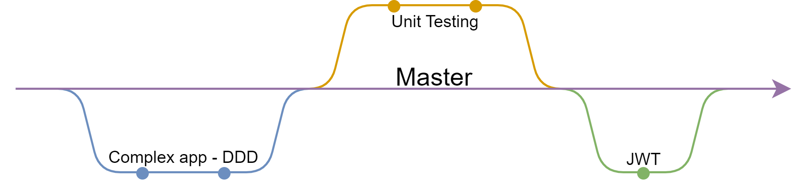

# C# app example

This repository presents an classical application in C#/.NET. This example show three main design patterns/functionnalities :
- a complex application using Domain Driven Design (DDD),
- unit testing,
- authentification/authorization using JSON Web Tokens.

This application has been created to present the three subjects to job seekers during their 8-month formation to become back-end ASP.NET software engineers in the span of three courses. The three different modules are separated into three branches, with commits indicating each step to create this app, as seen in the figure 1, with dots representig the different pull requests containing the explanatory commits. The app created to present such modules begins as an application to manage weather forecasts and it evolves into an application to manage events, with users with different roles such as admin and users. It uses .JSON databases as the SQL database was not part of the subject of these three courses.

<head>
   
  <figcaption><b>Fig.1 - Timeline diagram representing the different branches and their relations to the master branch as well as the pull requests added by each branch represented by dots</b>
</head>

## Complex application using Domain Driven Design (DDD)
The complex app follows the DDD - Domain Driven Design - pattern. This means that the app is centered around domains which implements the business part of the application where other parts of the app exists for more technical and implementation reasons. As such the app is divided in 4 projects :

- the `Site` project, which includes controllers and view models (which are then used by the front-end). This project is the project from which the app begins through the `Program.cs` and `Startup.cs`. `Startup.cs` contains all important configurations for our app.
- the `Core` project contains models and enums that are used in the rest of the application. This is where our objects are defined to be used in the business project and data project. These models are translated to the view models thanks to `Automapper`. All definitions of theses maps are defined in `Startup.cs`.
- the `Business` project contains our domains which are defined by interfaces. This project contains the business rules that define the appliction according to the domain driven design.
- the `Data` project, as its name indicates, takes care of the data by creating, reading, updating and deleting (CRUD) data from the database. For the scope of this example, the database is for now only a .JSON database.

This complex app makes also use of dependency injection to use the interfaces and their implementations and also briefly introduces the concept of lifetimes.

In order to practice the development of a DDD application, we also create the `WeatherForecastSearchParams` to search in the `WeatherForecast` database according to some search parameters. The search parameters are the date, temperature in Celsius and the description. This implies the creation of new call methods in the controller that redirects to the domain (through its interface) and then to the repository (through its interface).

## Implement Unit Testing
To implement unit testing on the data project, we add a project using Unit Testing. The `City` model, domain, repository and interfaces have been added in order to be tested. The `City` object is added as a propriety in the WeatherForecast object. All the tests are using the classical "Arrange, Act, Assert" pattern to tests the methods. These first tests here are aiming to verify that the database is not corrupted with invalid data. 
- The first test is a dummy, example test as this test succeeds only if the database is corrupted. 
- The following tests are using a fake database that is created in the constructor and deleted in the dispose method. The tests must then check that errors are thrown by the method in the real repository when this database is loaded. To load this fake database in the repository, the database path in the repository is modified in the Arrange section of our tests. The Arrange section also takes care of adding corrupted data to the fake database. This pull request is the first to use GitHub actions to check that all unit tests are passing.

The method addcities is added in the controller, domain and repository.
Another added method is `SetIdentifier` which makes sure that new entries in the database have a superior identifier in relation to the existing entries. A test is also added to make sure that this method works.  
Furthermore, the Business test project is added, which tests the method `addCities` with inline data, member data or class data and makes use of a fake repository through its interface.

## Authentification and authorization using JSON web tokens
This module aims to add the example of authentification and authorization thanks to JSON Web Tokens. For this, settings about JWT have been added in the appsettings, configuration of a JWT bearer has been added to the services' configuration of the startup class, as well as the configuration of Swagger to add authorization. `Users` have been added (controller, core model, view model, domain, repositories and database). The `Login` viewmodel has also been added, it allows to use only the username and password when a user desires to log into the app. The domain takes then care of the creation of the token if it exists in the database. 

Lastly, a refresh token has been added to avoid reintering username and password each time the JWT expires, it includes adding methods in the user controller, and view models. It is important to note that is app is clearly not suitable for production and opening to a market knowing that the database is only some .JSON files without any security. This app serves as an example on how to use JWT in a DDD application among other things.
